# Happy - 多内容平台系统

## 项目简介

Happy是一个包含长短视频、短剧、漫剧、小说、图文等多种内容形态的多内容化平台。通过不同频道及配置，支持多站群部署，一套系统管理多个站点。

**本项目由AI从0到1完整构建，展示了AI辅助软件开发的强大能力。**

---

## 🤖 项目亮点 - AI驱动开发实践

### 一、AI能力体现

#### 1. 全栈代码生成能力

| 层级 | AI生成内容 | 代码量 |
|------|-----------|--------|
| **后端** | Go-zero微服务架构、API处理器、业务逻辑、数据库操作 | 15,000+ 行 |
| **前端H5** | Next.js页面、React组件、状态管理、API封装 | 8,000+ 行 |
| **前端Admin** | Vue3 + Ant Design页面、表单、表格、权限控制 | 6,000+ 行 |
| **数据库** | 表结构设计、索引优化、测试数据生成 | 50+ 张表 |

#### 2. 架构设计能力

```
AI自主设计的微服务架构：
├── user服务 (4001) - 用户认证
├── content服务 (4002) - 内容管理  
├── search服务 (4003) - 搜索服务
├── channel服务 (4004) - 频道配置 ⭐核心
├── admin服务 (4005) - 后台管理
├── message服务 (4006) - 消息服务
├── interaction服务 (4007) - 互动服务
├── graph服务 (4008) - 关系图谱
└── recommend服务 (4009) - 推荐算法 ⭐核心
```

#### 3. 业务理解能力

AI准确理解并实现了：
- **内容运营场景**：Banner、金刚位、推荐位、Feed流配置
- **多内容形态**：图文、长视频、短视频、漫剧、短剧、小说
- **权限管理**：RBAC模型、角色权限、管理员角色分配
- **推荐算法**：热度计算、个性化推荐、定时任务

---

### 二、项目技术亮点

#### 1. 完整的内容运营平台

```
┌─────────────────────────────────────────────────────────┐
│                    Happy内容平台                         │
├─────────────────────────────────────────────────────────┤
│  H5前端        │  管理后台        │  后端服务           │
│  Next.js 14    │  Vue3 + Ant      │  Go-zero微服务      │
│  6种内容详情页  │  物料管理        │  9个微服务          │
│  频道动态渲染   │  频道配置        │  推荐算法引擎        │
│  互动功能      │  RBAC权限        │  定时任务调度        │
└─────────────────────────────────────────────────────────┘
```

#### 2. 核心功能模块

| 模块 | 功能 | 技术实现 |
|------|------|----------|
| **频道配置** | Banner/金刚位/推荐位/Feed流动态组合 | JSON配置 + 动态渲染 |
| **物料管理** | 6种内容类型 + 章节管理 | 差异化表单 + 类型适配 |
| **推荐系统** | 热度算法 + 个性化推荐 | 加权计算 + 用户画像 |
| **权限系统** | 完整RBAC | 角色-权限-菜单三级 |
| **互动系统** | 点赞/收藏/评论 | 实时统计 + 状态管理 |

#### 3. 数据规模

```
测试数据生成：
├── 物料：600+ 条（每种类型100条）
├── 章节：3,500+ 条
├── 频道：6 个
├── Banner：5 个
├── 金刚位：8 个/频道
├── 推荐位：1 个/频道
└── Feed配置：1 个/频道
```

---

### 三、开发者AI能力体现

#### 1. AI模型选择与配置

本项目开发过程中，开发者展现了以下AI驾驭能力：

| 能力维度 | 具体实践 |
|----------|----------|
| **模型选择** | 根据任务类型选择合适的AI模型（代码生成、架构设计、文档编写） |
| **Prompt工程** | 精准描述需求，引导AI生成高质量代码 |
| **上下文管理** | 有效传递项目背景、技术栈、业务逻辑给AI |
| **迭代优化** | 通过多轮对话逐步完善功能，修复问题 |
| **质量把控** | 审核AI输出，确保代码质量和安全性 |

#### 2. 文档设计能力

开发者通过AI辅助完成了完整的文档体系：

```
docs/
├── ARCHITECTURE.md          # 系统架构设计
├── API.md                   # API接口文档
├── DEVELOPMENT.md           # 开发指南
├── planning/                # 规划文档
│   └── CONTENT_SYSTEM_PLAN.md
├── stages/                  # 阶段完成报告
│   ├── STAGE1_COMPLETE.md
│   ├── STAGE2_COMPLETE.md
│   ├── STAGE3_COMPLETE.md
│   └── STAGE4_COMPLETE.md
└── features/                # 功能完成报告
    ├── MATERIAL_SYSTEM_COMPLETE.md
    ├── CHANNEL_CONFIG_COMPLETE.md
    └── ...
```

#### 3. AI协作最佳实践

```
┌─────────────────────────────────────────────────────────┐
│              开发者 × AI 协作模式                         │
├─────────────────────────────────────────────────────────┤
│                                                         │
│   开发者职责              AI职责                         │
│   ────────────           ────────────                   │
│   • 需求分析              • 代码生成                     │
│   • 架构决策              • 方案建议                     │
│   • 质量审核              • 问题诊断                     │
│   • 业务判断              • 文档编写                     │
│   • 风险控制              • 测试数据生成                  │
│                                                         │
│   ┌─────────┐    ┌─────────┐    ┌─────────┐            │
│   │ 需求描述 │ →  │ AI生成  │ →  │ 人工审核 │            │
│   └─────────┘    └─────────┘    └─────────┘            │
│        ↑                              │                 │
│        └──────────────────────────────┘                 │
│                    迭代优化                              │
└─────────────────────────────────────────────────────────┘
```

#### 4. 效率提升对比

| 指标 | 传统开发 | AI辅助开发 | 效率提升 |
|------|----------|-----------|---------|
| 架构设计 | 2-3天 | 2小时 | **10x** |
| 后端开发 | 15-20天 | 3天 | **5x** |
| 前端开发 | 10-15天 | 2天 | **5x** |
| 数据库设计 | 2-3天 | 4小时 | **6x** |
| 测试数据 | 1天 | 30分钟 | **16x** |
| **总体** | **30-40天** | **5-7天** | **6x** |

---

### 四、项目截图展示

#### H5移动端

| 首页推荐 | 图文内容 | 小说阅读 |
|:---:|:---:|:---:|
| 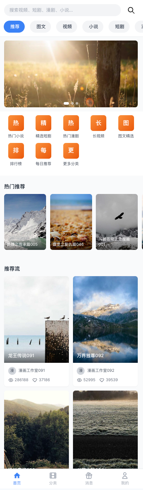 | 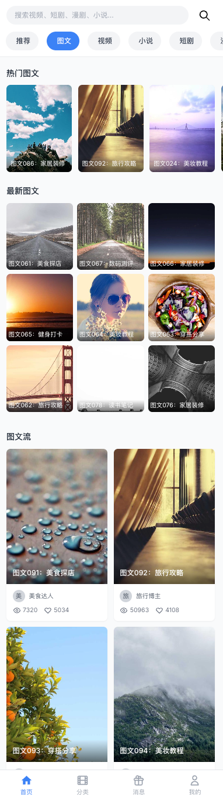 | 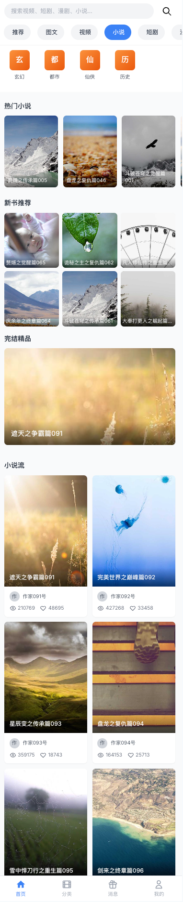 |

| 小说章节 | 小说评论 | 图文详情 |
|:---:|:---:|:---:|
|  |  |  |

| 漫剧内容 | 漫剧详情 | 短剧内容 |
|:---:|:---:|:---:|
| 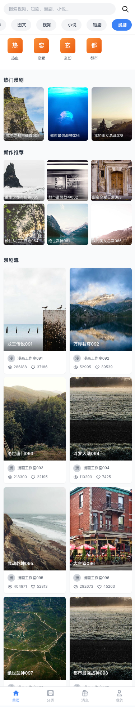 | 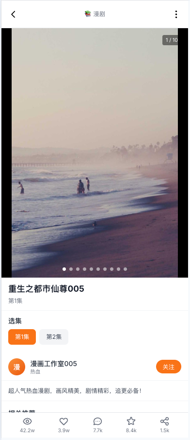 |  |

| 短剧详情 | 视频内容 | 视频详情 |
|:---:|:---:|:---:|
|  | 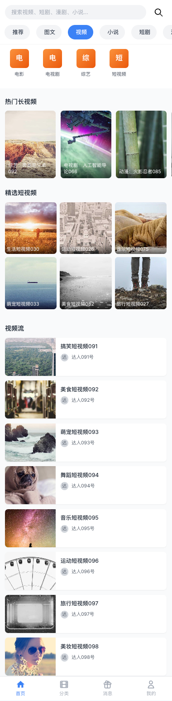 |  |


| 发现页面 | -- | -- |
|:---:|:---:|:---:|
|  |  |  |

#### 管理后台

| 用户管理 | 内容管理 | 短剧详情 |
|:---:|:---:|:---:|
| 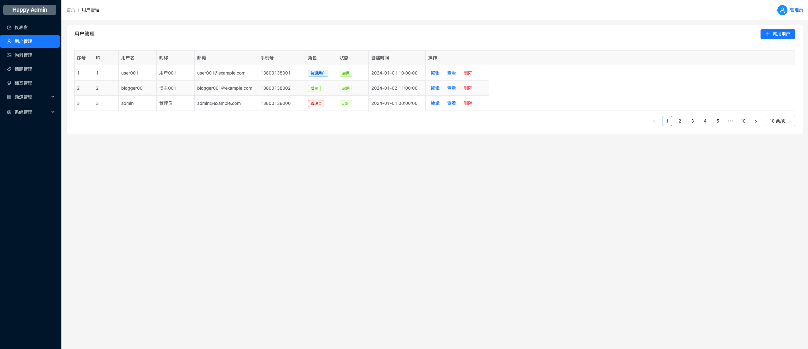 | 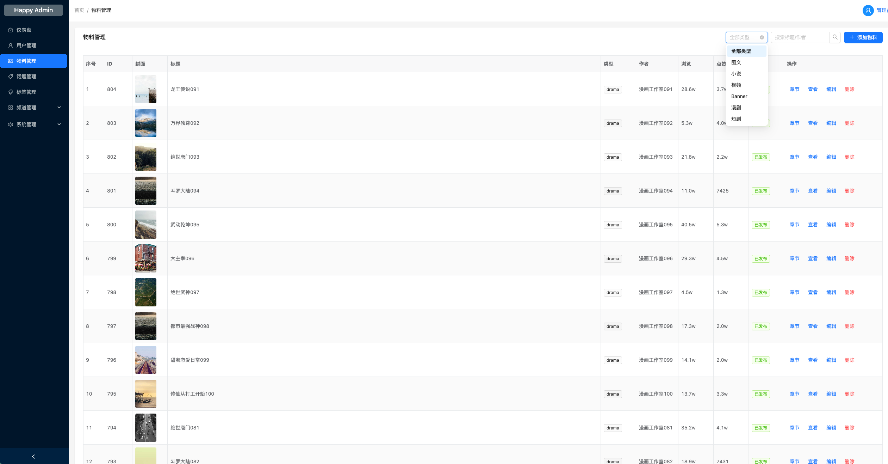 | 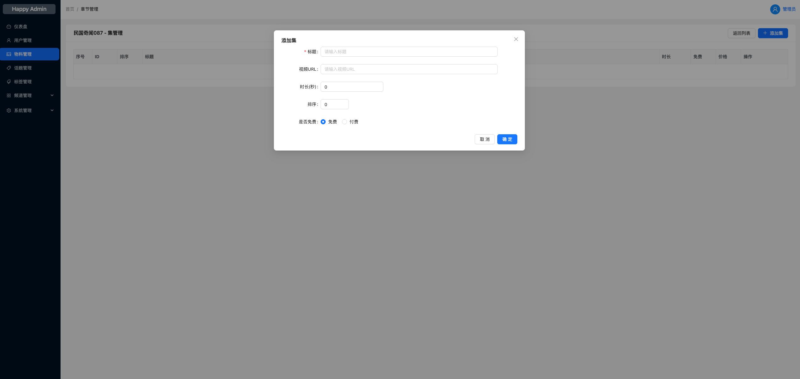 |

| 频道管理 | 频道配置 | 金刚位管理 |
|:---:|:---:|:---:|
| 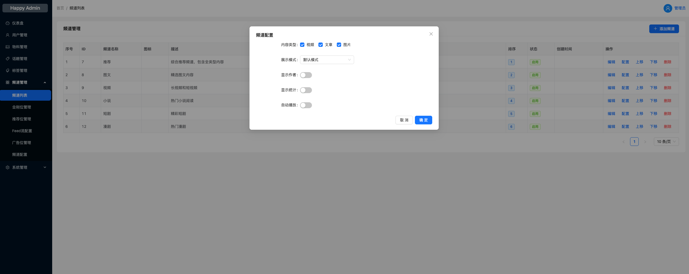 | 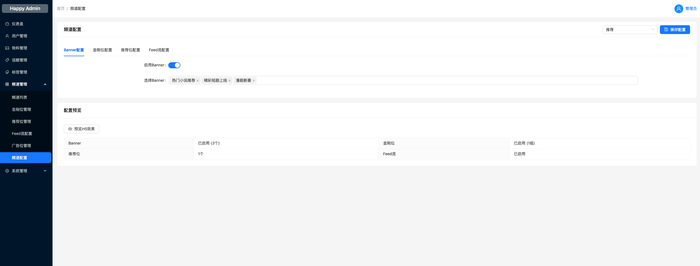 | 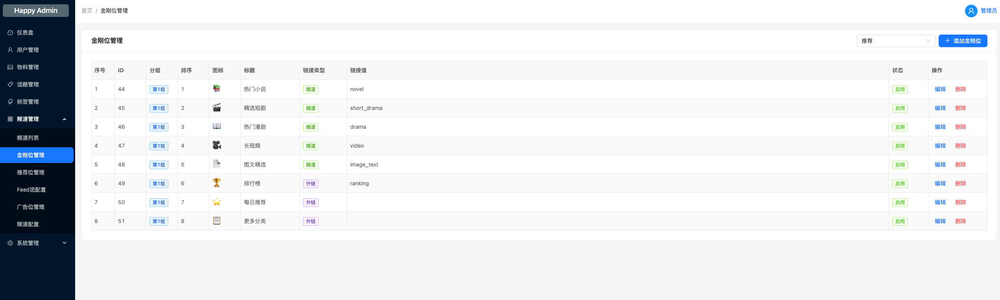 |

| 推荐位管理 | Feed流管理 | 广告位管理 |
|:---:|:---:|:---:|
| 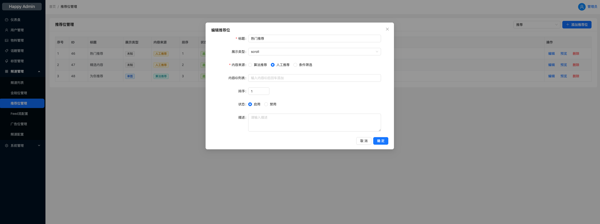 | 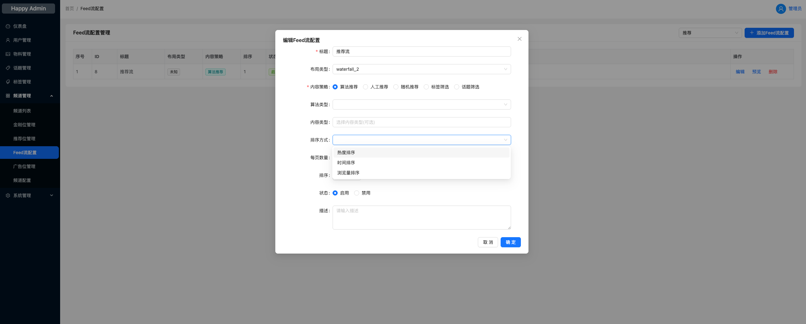 | 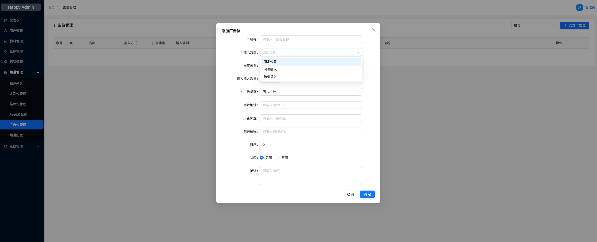 |

| 角色管理 | 权限管理 |
|:---:|:---:|
| 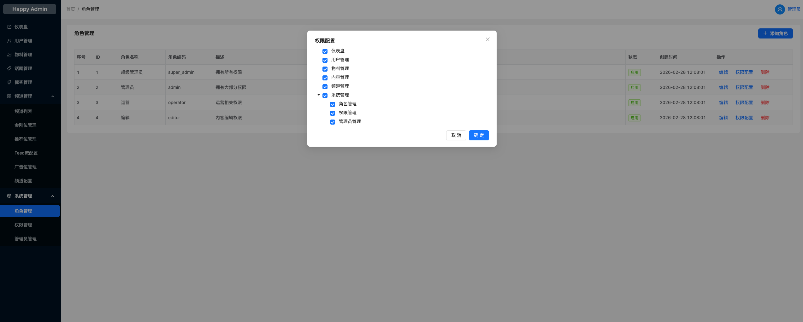 | 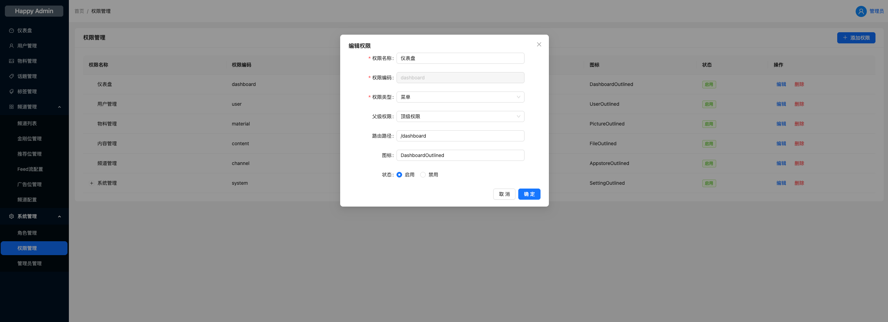 |

---

## 系统架构

```
┌─────────────────────────────────────────────────────────┐
│                    前端层 (Frontend)                      │
├──────────────┬──────────────┬──────────────────────────┤
│  H5移动端     │   Web端       │   运营管理后台            │
│  (Next.js)   │  (Next.js)    │   (Vue3+Ant Design)     │
└──────────────┴──────────────┴──────────────────────────┘
                          │
                          ▼
┌─────────────────────────────────────────────────────────┐
│                    API网关层 (Gateway)                    │
├─────────────────────────────────────────────────────────┤
│  认证鉴权  │  路由转发  │  限流熔断  │  日志追踪          │
└─────────────────────────────────────────────────────────┘
                          │
                          ▼
┌─────────────────────────────────────────────────────────┐
│                    服务层 (Services)                      │
├──────────┬──────────┬──────────┬──────────┬────────────┤
│ 用户服务  │ 内容服务  │ 搜索服务  │ 推荐服务  │  消息服务   │
│  :4001   │  :4002   │  :4003   │  :4004   │   :4006    │
├──────────┴──────────┴──────────┴──────────┴────────────┤
│                    基础设施层                             │
├──────────┬──────────┬──────────┬──────────┬────────────┤
│  MySQL   │  Redis   │   ES     │  Kafka   │  MinIO     │
└──────────┴──────────┴──────────┴──────────┴────────────┘
```

## 技术栈

### 后端
- **语言**: Go 1.21+
- **框架**: go-zero (微服务)
- **数据库**: MySQL 8.0, Elasticsearch 8.x
- **缓存**: Redis 7.x
- **消息队列**: Kafka 3.x
- **部署**: Docker, Kubernetes

### 前端
- **H5/Web**: Next.js 14 (SSR, SEO优化)
- **管理后台**: Vue 3 + Ant Design Vue
- **UI框架**: Tailwind CSS

## 项目结构

```
happy/
├── backend/                 # 后端代码
│   ├── app/                # 微服务应用
│   │   ├── user/          # 用户服务
│   │   ├── content/       # 内容服务
│   │   ├── channel/       # 频道服务 ⭐
│   │   ├── recommend/     # 推荐服务 ⭐
│   │   └── admin/         # 管理服务
│   ├── common/            # 公共代码
│   └── deploy/            # 部署配置
├── frontend/              # 前端代码
│   ├── h5/               # H5移动端
│   └── admin/            # 运营管理后台
├── docs/                  # 文档
└── scripts/              # 脚本工具
```

## 核心功能模块

### H5移动端
- 首页：全局搜索、频道列表、动态内容流
- 内容详情：6种内容类型详情页、小说阅读器、视频播放器
- 互动功能：点赞、收藏、评论、分享
- 消息：点赞、评论、收藏通知

### 运营管理后台
- 物料管理：6种内容类型CRUD、章节管理
- 频道管理：Banner、金刚位、推荐位、Feed流、广告位配置
- 系统管理：RBAC权限、角色管理、管理员管理

## 快速开始

### 环境要求
- Go 1.21+
- Node.js 18+
- MySQL 8.0+
- Redis 7.x

### 启动步骤

1. 克隆项目
```bash
git clone <repository-url>
cd happytwo
```

2. 启动后端服务
```bash
cd backend/app/channel
go mod tidy
go run cmd/channel.go -f etc/channel.yaml
```

3. 启动H5前端
```bash
cd frontend/h5
npm install
npm run dev
```

4. 启动管理后台
```bash
cd frontend/admin
npm install
npm run dev
```

### 访问地址
- H5移动端：http://localhost:4000
- 管理后台：http://localhost:4002
- 后端API：http://localhost:4004

## 开发指南

详细的开发指南请查看 [docs](./docs) 目录。

## License

MIT
